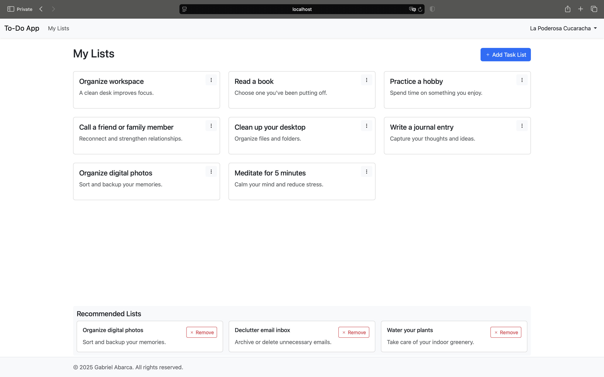
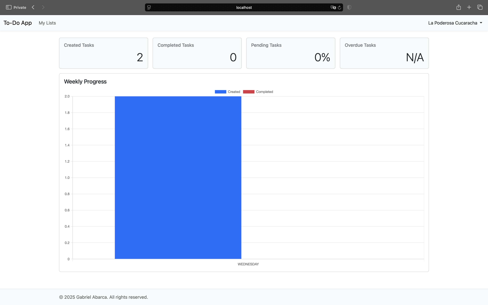
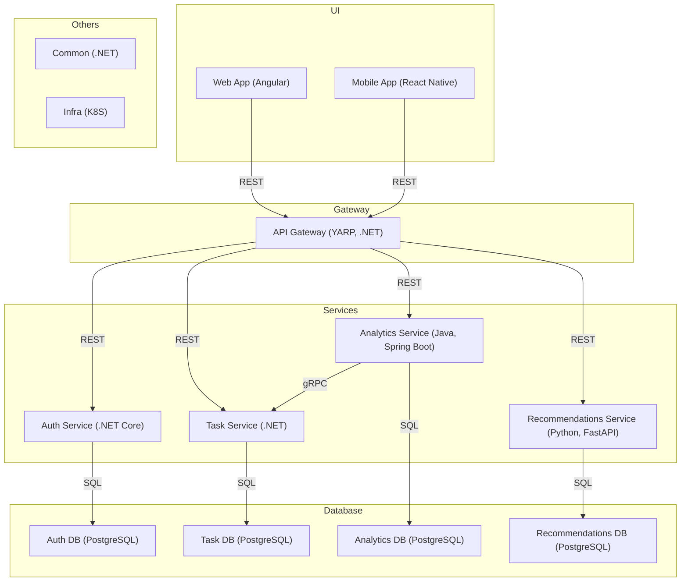

# TODO Monorepo 📝

This monorepo contains the complete suite of services and clients for the TODO application platform, organized under the `src/` directory for clear modularity and scalability.

---

## Screenshots 🖼️

Here are some screenshots of the TODO platform in action:

| Task Lists | Landing Page | Analytics Dashboard |
|:-----------------:|:------------------------:|:-------------------:|
|  |  |  |

> _For more visuals, see the `docs/images/` directory._

---

## About the Project 🚀

The TODO platform is built on a microservices architecture, delivering a scalable and modular task management solution.

---

## Project Structure 🗂️

```
todo.monorepo/
├── src/
│   ├── infra/                  # Infrastructure: Helm charts, deployment scripts, Docker configs ⚙️
│   ├── ui/
│   │   ├── web/                # Angular frontend client 🌐
│   │   ├── mobile/             # React Native mobile client 📱
│   ├── db/                     # Database migrations and seeders 🗄️
│   ├── libs/
│   │   └── todo.common/        # Shared libraries and utilities 🧰
│   ├── services/
│   │   ├── todo.recommendation/   # Recommendation microservice 🤖 (Python, FastAPI)
│   │   ├── todo.analytics/        # Analytics microservice 📊 (Java, Spring Boot)
│   │   ├── todo.auth-service/     # Auth microservice 🔐 (.NET Core)
│   │   ├── todo.task-service/     # Task management microservice ✅ (.NET Core)
│   ├── gateway/                # API Gateway service 🚪 (.NET Core, YARP)
├── docs/                       # Project documentation 📚
├── docker-compose.yml          # Multi-service orchestration file for local 🐳
├── README.md                   # Project overview 📄
├── LICENSE                     # License information 📜
```

---

## Architecture Diagram 🏗️

Below is a high-level architecture diagram illustrating the relationships between the main services in the TODO platform:


**Diagram Explanation**

- **UI Layer:**  
  The Web App ([todo.angular-client](https://github.com/Abstractize/todo.angular-client), Angular) and Mobile App ([todo.react-native-mobile](https://github.com/Abstractize/todo.react-native-mobile), React Native) serve as the main user interfaces, communicating with the API Gateway via REST APIs.

- **API Gateway:**  
  The API Gateway ([todo.gateway](https://github.com/Abstractize/todo.gateway), YARP, .NET Core) acts as a unified entry point, routing client requests to backend microservices.

- **Services Layer:**  
  - **Auth Service:** ([todo.auth-service](https://github.com/Abstractize/todo.auth-service), Python, FastAPI)  
    Manages authentication and authorization.
  - **Task Service:** ([todo.task-service](https://github.com/Abstractize/todo.task-service), .NET Core)  
    Handles task management and lifecycle.
  - **Analytics Service:** ([todo.analytics](https://github.com/Abstractize/todo.analytics), Python, FastAPI)  
    Processes analytics and event tracking.
  - **Recommendations Service:** ([todo.recommendations](https://github.com/Abstractize/todo.recommendations), Python, FastAPI)  
    Delivers personalized task recommendations.

- **Database Layer:**  
  Each microservice uses its own PostgreSQL database for isolation and scalability. Database migrations and seed data are managed by [todo.db](https://github.com/Abstractize/todo.db).

- **Infrastructure & Shared Libraries:**  
  - **Infrastructure:** ([todo.infra](https://github.com/Abstractize/todo.infra))  
    Helm charts, Docker Compose, and deployment scripts for provisioning and orchestration.
  - **Shared Libraries:** ([todo.common](https://github.com/Abstractize/todo.common))  
    Shared utilities, models, and helpers used across services.

- **Inter-Service Communication:**  
  - The Analytics Service communicates with the Task Service using gRPC for efficient data exchange.
  - All other service-to-database interactions use SQL.

This architecture promotes modularity, scalability, and clear separation of concerns.

> _Edit or view this diagram using the [Mermaid Live Editor](https://mermaid.live/)._

---

## Why This Monorepo? 🤔

- **Unified Development Experience:** All related projects are in one place, simplifying cross-service changes.
- **Consistency:** Shared configurations and dependencies reduce integration friction.
- **Scalability:** Modular service architecture designed for easy extension.
- **Demonstration of Expertise:** Showcases proficiency in multiple languages, frameworks, and modern DevOps practices.

---

## Getting Started 🏁

### Example `.env` File

Copy the following into a `.env` file at the project root to configure local development:

```env
SQL_USERNAME=
SQL_PASSWORD=

SQL_CONNECTION_STRING_AUTH=
SQL_CONNECTION_STRING_TASK=
SQL_CONNECTION_STRING_ANALYTICS=
SQL_CONNECTION_STRING_RECOMMENDATIONS=

JWT_KEY=
JWT_ISSUER=
JWT_AUDIENCE=

GITHUB_TOKEN=
GITHUB_USERNAME=
```

> **Note:**  
> - Never commit your real `.env` file with secrets to version control.   
> - Update secrets and credentials as needed for your environment.

To launch the entire platform for local development, use the provided script:

```bash
./docker-compose-up.sh
```

This command builds and starts all services and dependencies in containers, ensuring a consistent development and testing environment.

- **Hot Reload Support:**  
  Most services support hot reloading for rapid development cycles.
- **Service Isolation:**  
  Each microservice runs in its own container, making it easy to debug and iterate independently.
- **Environment Configuration:**  
  Environment variables and configuration files can be customized for local overrides.

Refer to this `README.md` or the `docs/` directory for advanced configuration and troubleshooting tips.

---

## Contact & More Info 📬

For detailed documentation on each service, visit their respective repositories linked above or contact the maintainers.

---

## License 📜

This project is licensed under the MIT License.

